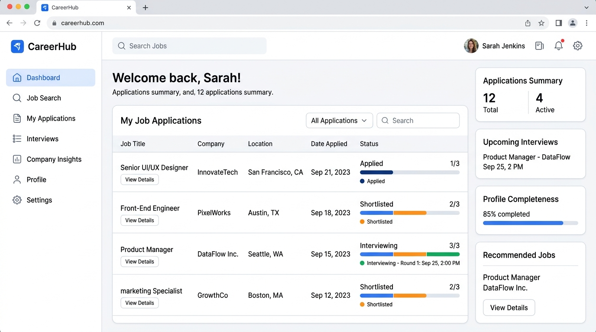
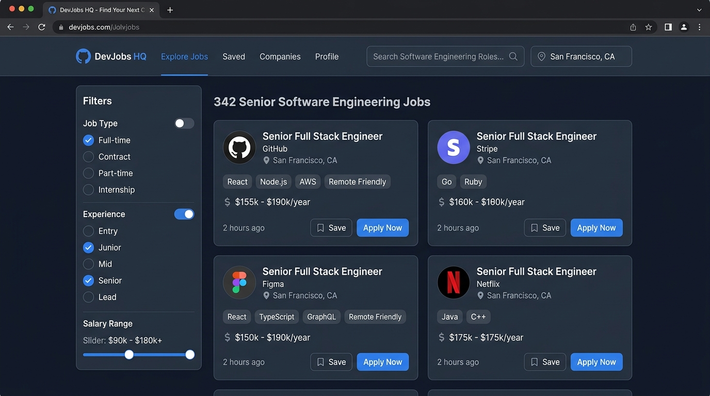
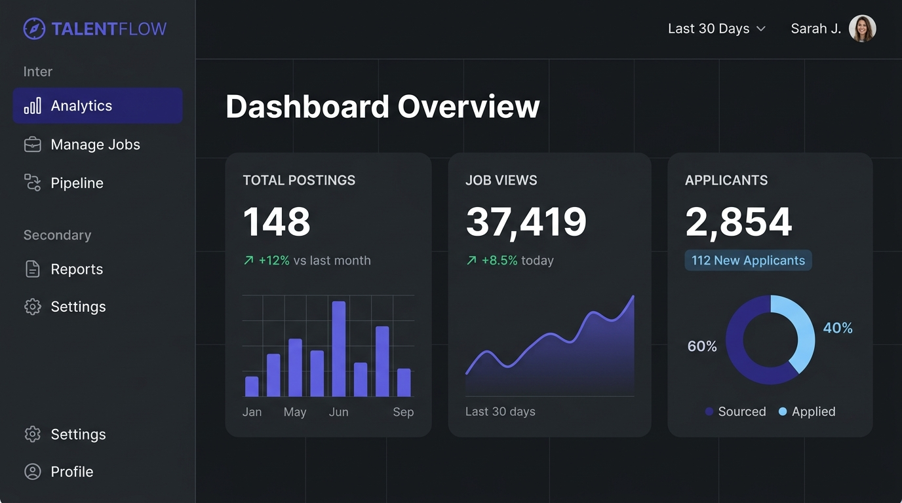

# Application Features

This document provides a detailed breakdown of all features implemented in the JobBoard application, outlining their user-facing behavior and underlying technical implementations.

---

## Job Seeker Features

### Job Search and Filtering
Seekers can search for open job listings using keyword search and refine the results using multi-select checkbox filters and salary inputs.
*   **Technical Implementation**: 
    *   **Page**: `src/app/page.tsx`
    *   **Components**: `src/components/JobCard.tsx`, `src/components/SkeletonCard.tsx`
    *   **API Endpoint**: `GET /api/jobs`
    *   **Query Logic**: Uses Prisma's `findMany` database queries with case-insensitive `contains` operators for search strings and `in` filters for arrays of selected types/experience levels. Incorporates skip/take offset pagination.
*   **Screenshot**:
    

### Job Application Flow
Seekers can apply to a job posting by entering their details, writing an optional cover letter, and uploading a resume or using a saved resume.
*   **Technical Implementation**:
    *   **Page**: `src/app/jobs/[id]/page.tsx`
    *   **API Endpoint**: `POST /api/applications/[jobId]`
    *   **Query Logic**: Evaluates if the applicant has already applied. Saves the application records via Prisma's `application.create` linking the Seeker and Job models.
*   **Screenshot**:
    

### Bookmarking / Saved Jobs
Seekers can bookmark job postings while browsing to save them for later application submissions.
*   **Technical Implementation**:
    *   **Page**: `src/app/page.tsx`, `src/app/jobs/[id]/page.tsx`, `src/app/seeker/page.tsx`
    *   **API Endpoint**: `POST /api/seeker/bookmarks/[jobId]`
    *   **Query Logic**: Toggles bookmark states. If a bookmark record matching `userId_jobId` exists, it deletes it; otherwise, it creates a new `Bookmark` record in the database.
*   **Screenshot**:
    

### Seeker Dashboard and Status Tracking
Seekers have access to a dashboard displaying their submitted applications, saved job listings, and application progression pipelines.
*   **Technical Implementation**:
    *   **Page**: `src/app/seeker/page.tsx`
    *   **API Endpoint**: `GET /api/seeker/dashboard`
    *   **Query Logic**: Performs parallel transactions to fetch `application.findMany` (including job details) and `bookmark.findMany` filtered by the logged-in seeker's ID.
*   **Screenshot**:
    

### Seeker Resume / Profile Management
Seekers can update their name, professional title, skills list, bio descriptions, and view their currently saved resume.
*   **Technical Implementation**:
    *   **Page**: `src/app/seeker/page.tsx` (Profile tab)
    *   **API Endpoint**: `PUT /api/seeker/profile`
    *   **Query Logic**: Updates the user's name on the `User` database model and profile fields on the `Profile` database model in a transaction wrapper.
*   **Screenshot**:
    

---

## Employer Features

### Job Posting Creation and Management
Employers can create new job listings by filling in requirements, type details, salary caps, and descriptions, and can edit or delete existing postings.
*   **Technical Implementation**:
    *   **Page**: `src/app/employer/page.tsx` (Post / Edit tab)
    *   **API Endpoints**: `POST /api/jobs` (Create), `PUT /api/jobs/[id]` (Update), `DELETE /api/jobs/[id]` (Delete)
    *   **Query Logic**: Validates employer ownership before updating or deleting listings. Deletes cascaded applications and bookmarks automatically.
*   **Screenshot**:
    

### Applicant Tracking and Status Pipeline
Employers can view all candidates who applied to their postings, read cover letters, view resumes, and update status markers in the pipeline.
*   **Technical Implementation**:
    *   **Page**: `src/app/employer/page.tsx` (Pipeline tab)
    *   **API Endpoints**: `GET /api/applications/employer` (List), `PATCH /api/applications/status/[id]` (Update status)
    *   **Query Logic**: Checks if the target application's job was posted by the requesting employer. Performs a `PATCH` updating the `status` string field to `APPLIED`, `SHORTLISTED`, `HIRED`, or `REJECTED`.
*   **Screenshot**:
    

### Employer Workspace Analytics
Employers can monitor recruitment health, overviewing total listing counts, accumulated views, total candidates, and status splits.
*   **Technical Implementation**:
    *   **Page**: `src/app/employer/page.tsx` (Analytics tab)
    *   **API Endpoint**: `GET /api/analytics/employer`
    *   **Query Logic**: Gathers aggregate view counts and candidate numbers using Prisma aggregations (`_count`) on jobs posted by the employer's ID.
*   **Screenshot**:
    

---

## Platform Features

### Authentication and Session Management
Secures user signup and logins, storing credentials using JWT tokens stored inside HTTP-Only Cookies to prevent client-side script theft.
*   **Technical Implementation**:
    *   **Pages**: `src/app/login/page.tsx`, `src/app/register/page.tsx`
    *   **Components**: `src/context/AuthContext.tsx`
    *   **API Endpoints**: `/api/auth/signup`, `/api/auth/login`, `/api/auth/logout`, `/api/auth/me`, `/api/auth/refresh`
    *   **JWT Logic**: Access tokens (valid for 15 minutes) and Refresh tokens (valid for 7 days) are set in HTTP-only cookies. Edge middleware (`src/middleware.ts`) checks these cookies for protected route access and performs role-based redirection.
*   **Screenshot**:
    

### Cloud File Storage (Vercel Blob Uploads)
Enables resume document uploads, storing files dynamically in Vercel Blob cloud storage with fallback local disk support.
*   **Technical Implementation**:
    *   **SDK**: `@vercel/blob`
    *   **API Endpoint**: `/api/applications/[jobId]`
    *   **Upload Logic**: Reads requests as Form Data, converts files to ArrayBuffers, and uploads via `put()` to Vercel Blob. Falls back to writing files to `/public/uploads/` on disk for offline local development if the Vercel API key is absent.
*   **Screenshot**:
    

### Native Dark Theme Preference
Provides custom theme selection supporting user system presets or explicit light/dark overrides.
*   **Technical Implementation**:
    *   **Component**: `src/components/Navbar.tsx`
    *   **Styling**: `src/app/globals.css`
    *   **Theme Logic**: Adds or removes the `.dark` class from the `html` root element. Persists choice locally using `window.localStorage`.
*   **Screenshot**:
    

### Mobile-First Responsive Design
Adapts application screens seamlessly across varying device resolutions.
*   **Technical Implementation**:
    *   **Component**: `src/components/Navbar.tsx` (Mobile Drawer menu), `src/app/page.tsx` (Mobile filter panel drawer)
    *   **Styling**: Compiles flexible grid displays, responsive flex alignments, and collapse drawer widgets using Tailwind CSS.
*   **Screenshot**:
    
